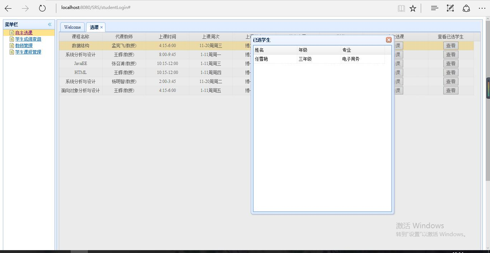
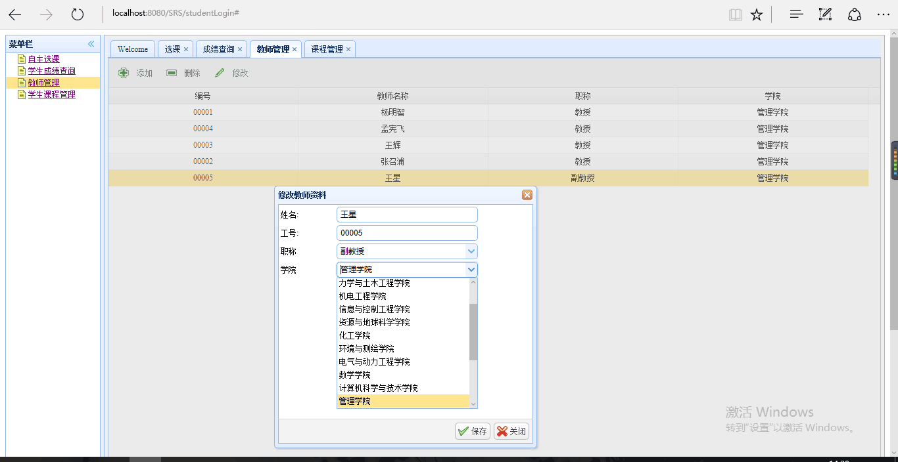
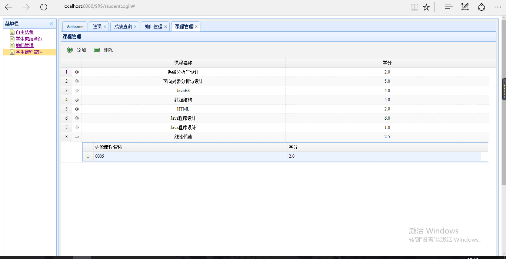

## 类图

## 顺序图

## 登录界面

## 学生选课代码判断

## 选课界面

## 符合各种选课标准——选课成功

## 由于已经选过该课程导致不能重复选择——选课失败

## 由于先修课不符合要求——选课失败

## 由于培养计划里没有此门课程——选课失败

## 查看此门课程有哪些人选过

## 学生成绩查询界面

## 教师信息管理界面

## 添加教师信息

## 删除教师信息

## 修改教师信息

## 学生课程管理界面

## 添加课程信息

## 添加课程成功界面

## 删除课程信息

## 成功删除所选课程界面

## 测试类——09143613学生选课测试

## 测试类——课程信息测试类

## 测试类——09143613学生成绩查询测试类

